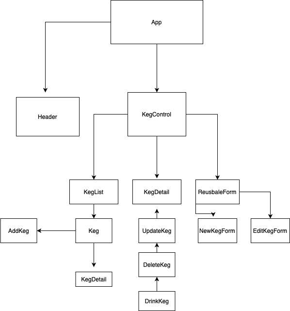

# Celeste's Wonderlust Winery 🍷

### React fundamentals, July 2, 2020

#### _**By: Celeste Field**_

## 
 Description

This application was built with React components and JSX, to create a winery inventory site. 

## 
 Component Diagram

## 
 User Stories

* As a user, I want to see a list/menu of all available kegs. For each keg, I want to see its name, brand, price and alcoholContent. √
* As a user, I want to submit a form to add a new keg to a list.√
* As a user, I want to be able to click on a keg to see its detail page.√
* As a user, I want to see how many glasses are left in a keg.√
* As a user, I want to be able to click a button next to a keg whenever I sell a glass of it. Glasses cannot go below 0. √
* As a user, I want the option to edit a keg's properties after entering them just in case I make a mistake. √
* As a user, I want to be able to delete a keg.√

## 
 Setup/Installation Requirements

#### Install this application -

* Clone this repository: https://github.com/fieldceleste/winery-app.git
* Open the repository folder in the terminal
* Open the folder in editor of choice
* Enter `$npm install `
* Then enter `$npm run build` to build production.
* To run on server type `$npm start`

 

## 
 Technologies Used 

* Git
* Javascript
* npm
* React
* Webpack 
* JSX
* Node

## 
 License

* This webpage is licensed under the MIT license.*

#### Copyright (c) 2020 **_Alex Skreen_**

